freigegebene Postfächer (Funktionspostfach)
============================================

.. index:: Postfach, Funktionspostfach, freigegebenes Postfach

Freigegebene Postfächer, im weiteren Funktionspostfächer, sind Postfächer auf die ein oder mehrere Benutzer Zugriff haben können. Eine direkte Anmeldung bei diesen Postfächern 
ist nicht möglich.

Sofern Sie Zugriff auf ein Funktionspostfach benötigen, hat Sie der Administrator für dieses Funktionspostfach in der Regel bereits berechtigt. Da der direkte 
Zugriff auf ein Funktionspostfach in der Schule durch den Administrator eingeschränkt ist, müssen Sie dieses Postfach in Outlook Web manuell einbinden.

.. hint::
	In der Desktopversion von Outlook ist dieser Schritt nicht notwendig, da hier das Funktionspostfach automatisch angezeigt wird.
	
Sofern Sie kein Zugriff auf Ihr Funktionspostfach haben, wenden Sie sich bitte an `help@planb-bildung.de`.

Funktionspostfach in Outlook Web anzeigen
******************************************

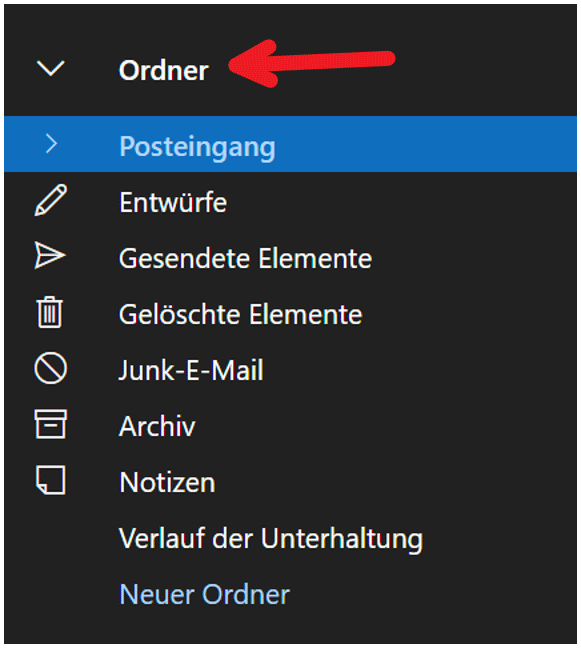
	
	**Ordner** mit der rechten Maustaste anklicken.
	
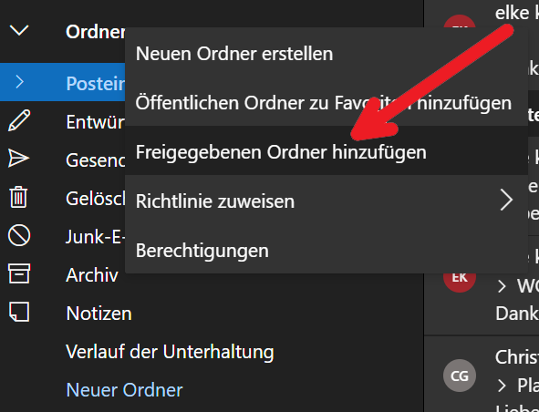
	
	**Freigegebene Ordner hinzufügen** auswählen.
	
.. figure:: ../../image/outlook/owa/pf-einbinden-3.png
	:alt: Bild 3
	:width: 50%
	
	**Name** oder **E-Mailadresse** des freigegebenen Postfaches eingeben.
	
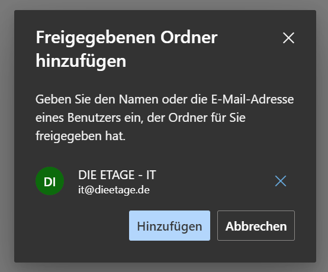
	
	**Hinzufügen** auswählen.
	
Das Funktionspostfach ist nun unter dem eigenen Postfach sichtbar.

von Funktionspostfach senden
*****************************

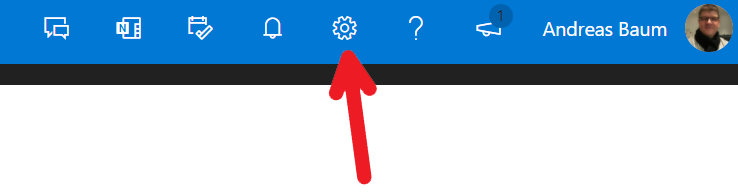
	
	**Einstellungen** auswählen.
	
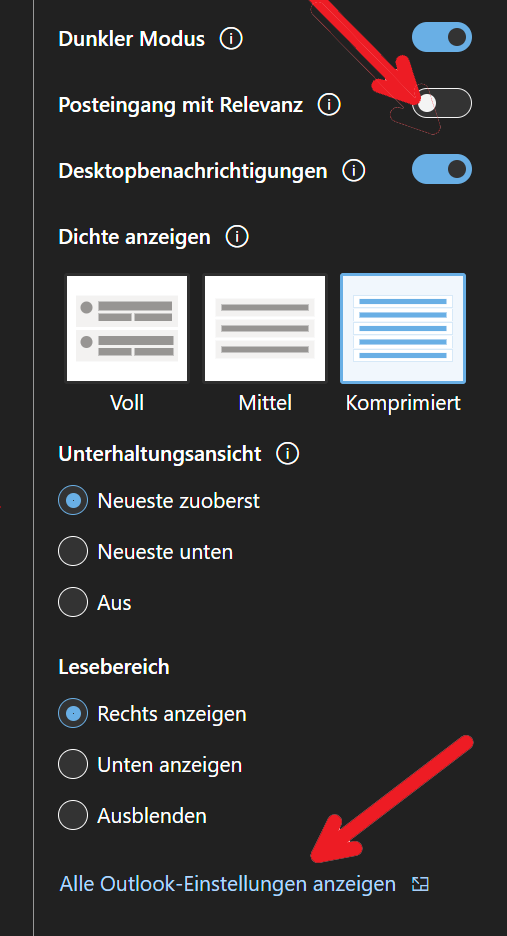
	
	**Posteingang mit Relevanz** deaktivieren. Hat zwar nichts mit dem eigenetlichen Thema zu tun aber wenn wir schon mal hier sind ;-). **Alle Outlook-Einstellungen anzeigen** auswählen.

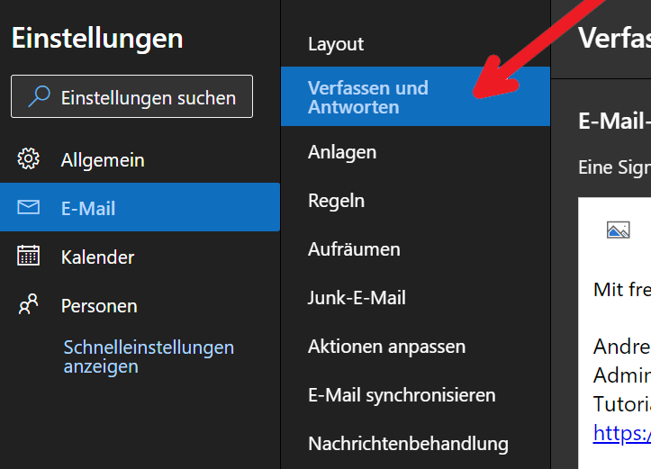
	
	**E-Mail** --> **Verfassen und Antworten** auswählen und hier…
	
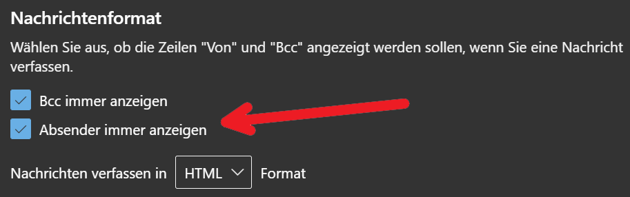
	
	**...Absender immer anzeigen** markieren und auf speichern drücken.
	
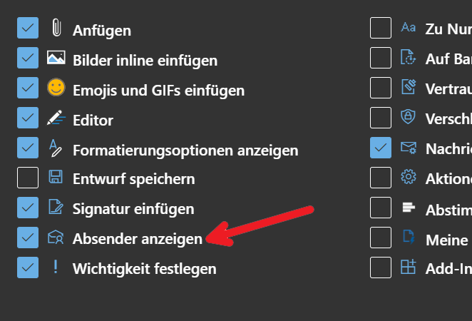
	
	**E-Mail** --> **Aktionen anpassen** auswählen und ganz unten **Absender anzeigen** markieren, wieder speichern und oben rechts mit X schließen.
	
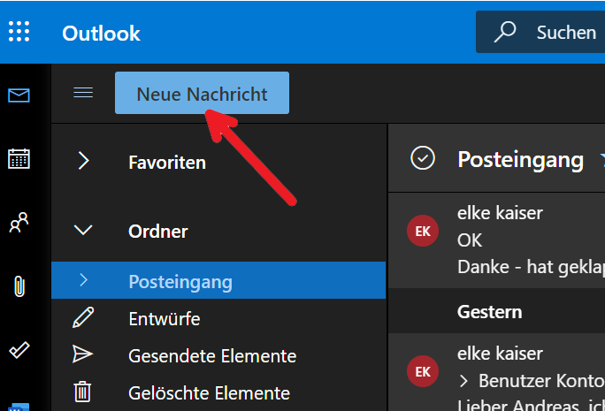
	
	**Neue Nachricht** auswählen.
	
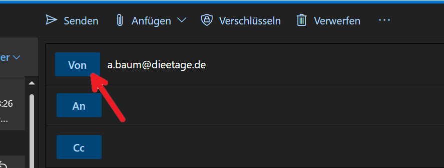
	
	Auf **Von** klicken.
	
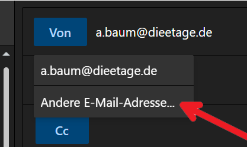
	
	**Andere E-Mailadresse…** auswählen.
	
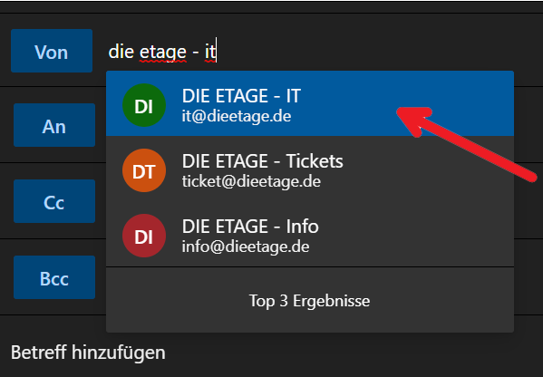
	
	Name oder E-Mailadresse des Postfaches eingeben und auswählen und eine Testmail an sich selbst senden.
	
.. hint::
	Bitte unbedingt mit den oben gemachten Einstellungen eine E-Mail an sich selbst oder einen anderen Empfänger senden. Unterbleibt dieser Schritt, kann es sein, 
	dass Outlook sich die E-Mailadresse des Funktionspostfaches nicht merkt.
	
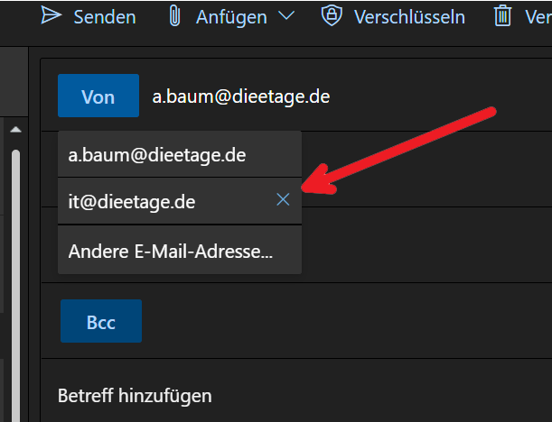
	
	Bei der nächsten neuen E-Mail kann mit Klick auf **Von** im Auftrag des Postfaches gesendet werden.
	
.. note::
	Bitte beachten Sie, dass grundsätzlich von Funktionspostfächern **im Auftrag** gesendet wird.  

Signatur und Abwesenheitsnotiz einrichten
***********************************************

Im nachfolgenden Video (1:59 min) wird Ihnen erläutert, wie Sie eine `Signatur <https://youtu.be/dVJE_nYE_94?t=0>`_ und 
eine `Abwesenheitsnotiz <https://youtu.be/dVJE_nYE_94?t=48>`_ einrichten.

.. hint::
	Eine Signatur wird automatisch am Ende Ihrer Nachricht eingefügt. Wenn Sie **im Auftrag** der Schule eine E-Mail verfassen oder beantworten, ist eine einheitliche Signatur vorgeschrieben.

.. hint::
	Eine Abwesenheitsnotiz informiert E-Mail-Absender, die Ihnen eine E-Mail zusenden, dass Sie auf Grund einer längeren Abwesenheit nicht sofort antworten können. Insbesondere bei Urlaub oder 
	Krankheit sollte eine Abwesenheitsnotiz eingerichtet werden.

.. raw:: html

	<iframe width="100%" height="400" src="https://www.youtube.com/embed/dVJE_nYE_94" title="YouTube video player" frameborder="0" allow="accelerometer; autoplay; clipboard-write; encrypted-media; gyroscope; picture-in-picture" allowfullscreen></iframe>

**Beispiel für eine Abwesenheitsnotiz:**
 |	`Sehr geehrte Damen und Herren,`
 |
 |	`vielen Dank für Ihre E-Mail. Ich bin bis einschließlich 18. Juli 2021 nicht zu erreichen. Ihr E-Mail wird nicht weitergeleitet. Bitte wenden Sie sich in dringenden Fällen an das Postfach xyz@dieetage.de`
 |
 |	`Mit freundlichen Grüßen`
 |
 |	Signatur
